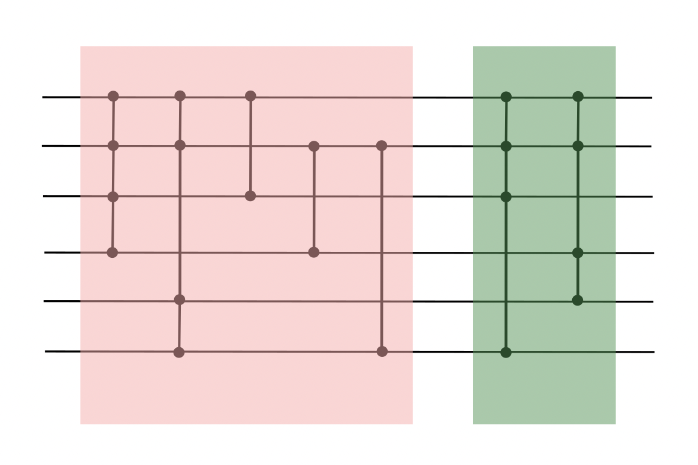

# Tailgating quantum circuits for high-order energy derivatives

This repository contains the code used to produce the numerical results in the paper *Tailgating quantum circuits for high-order energy derivatives*.

<p align="center">

</p>

The following functionality is supported:

- Performing variants of ADAPT-VQE, with respect to a supplied gate set and circuit
- Performing the tailgating procedure for an arbitrary gate set and supplied Hamiltonian derivatives
- Calculating Hamiltonians and Hamiltonian derivatives of a range of different molecules

This code runs on top of the [PennyLane](https://github.com/PennyLaneAI/pennylane) library for differentiable quantum programming. To build sparse representations of fermionic Hamiltonians and Hamiltonian derivatives for the examples, we utilize a prototype of the ``pennylane.hf`` module, which can be found [here](https://github.com/Lucaman99/autohf).

## Installation

To install this package, download the source code, navigate to the file, and run the following command:

```
python3 setup.py build_ext --inplace install --user
```

## Cite

[ADD PAPER REF]
